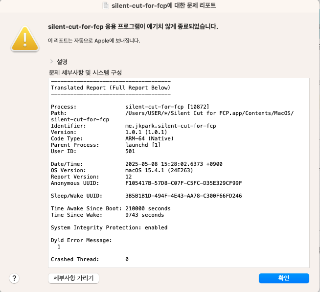

[](README.md)
[](README-ko.md)

Silent Cut for FCP는 비디오 파일에서 소리가 있는 부분만 자동으로 감지하여
Final Cut Pro에서 사용할 수 있는 FCPXML 파일로 변환해주는 데스크톱 애플리케이션입니다.

[사용 전 필수 프로그램 설치](#사용-전-필수-프로그램-설치-(macOS)) 섹션을 필수적으로 확인해주세요. 

## 제작자의 말

본 프로그램은 Park's Garage가 만들었습니다. 파이널컷 프로를 사용하고 계시는 분들께서,
좀 더 빠르고 효율적으로 영상 편집을 하는데 도움이 되었으면 좋겠습니다.

제작 과정은 다음 유튜브 영상을 참고해주세요. 이왕이면 구독과 좋아요도 눌러주세요! 

[](https://www.youtube.com/watch?v=P8be0132Yqw&t=0s)

## 주요 기능

- 비디오 파일에서 오디오 분석 및 소리가 있는 구간 자동 감지
- 감지된 구간을 Final Cut Pro 호환 FCPXML 파일로 내보내기
- 다양한 FPS 및 해상도 설정 지원

## 사용 전 필수 프로그램 설치 (macOS)

### homebrew 설치 

homebrew는 macOS를 위한 패키지 관리 프로그램입니다.

[Homebrew](https://brew.sh) 에 방문하여 homebrew 를 먼저 설치합니다.

또는, 터미널에서 다음 명령어를 사용하여 설치합니다.

```bash
/bin/bash -c "$(curl -fsSL https://raw.githubusercontent.com/Homebrew/install/HEAD/install.sh)"
```

### ffmpeg 설치 (macOS)

ffmpeg은 멀티미디어 파일에 대한 인코딩/디코딩을 위한 프로그램입니다. Silent Cut for FCP 는 ffmpeg 을 사용하여 비디오 내 오디오를 추출하므로 필수로 설치해야합니다.

homebrew 설치가 완료되었다면 터미널에서 다음 명령어를 사용하여 ffmpeg 을 설치합니다.


```bash
brew install ffmpeg@7
```

그리고, Silent Cut for FCP를 실행합니다.

## 개발 환경 설정

### 필수 조건

- [Node.js](https://nodejs.org/) (v18 이상)
- [Rust](https://www.rust-lang.org/tools/install) (최신 버전)
- [FFmpeg](https://ffmpeg.org/download.html) (시스템에 설치 필요)

### 환경 설정 과정

1. 저장소 복제
   ```bash
   git clone https://github.com/jookwang-park/silent-cut-for-fcp.git
   cd silent-cut-for-fcp
   ```

2. 의존성 설치
   ```bash
   pnpm install
   ```

3. 개발 모드로 실행
   ```bash
   pnpm tauri dev
   ```

## 트러블슈팅 

만약 다음 스크린샷과 같이 실행 시 오류가 발생한다면, `ffmpeg` 설치가 되지 않은 것입니다. 
[사용 전 필수 프로그램 설치](#사용-전-필수-프로그램-설치-(macOS)) 섹션을 확인하여 ffmpeg 설치해주세요.




```
Termination Reason:
Namespace DYLD, Code 1 Library missing
Library not loaded: /opt/homebrew/*/libavutil.59.dylib
Referenced from:
<C03F2050-46AE-3FCF-81B1-A8FAC54AFE9B> /Users/USER/*/Silent
Cut for FCP.app/Contents/MacOS/silent-cut-for-fcp
Reason: tried:
'/opt/homebrew/*/libavutil.59.dylib' (no such file), '/System/
Volumes/Preboot/Cryptexes/0S/opt/homebrew/*/libavutil.59.dylib' (no such file),
'/opt/homebrew/*/libavutil.59 dylib' (no such file)
```

## 라이선스

[MIT](LICENSE)

