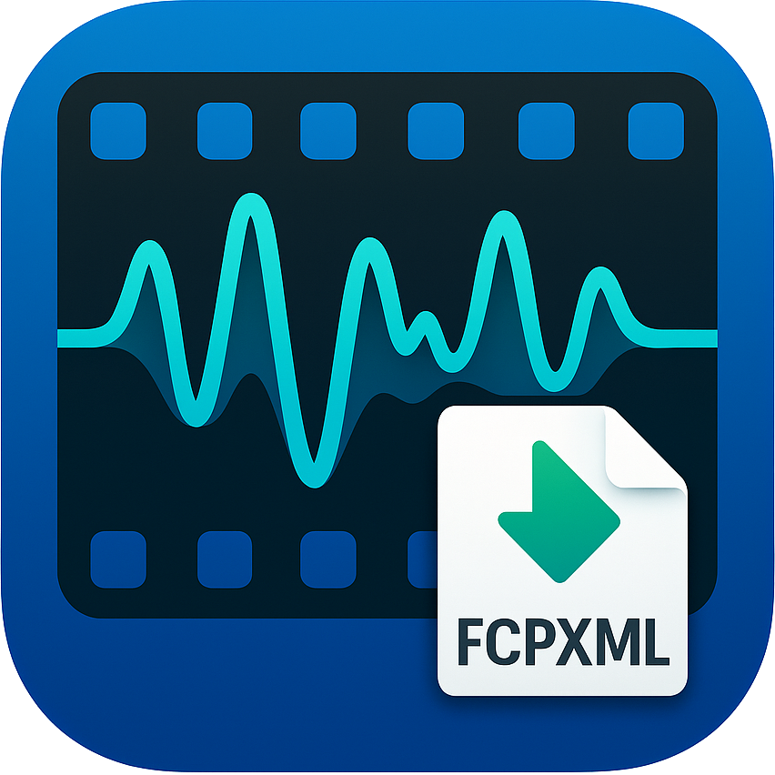

<p align="center">

</p>

[](README.md)
[](README-ko.md)


Silent Cut for FCP is a desktop application that automatically detects parts with sound in video files
and converts them into FCPXML files that can be used in Final Cut Pro.

Please make sure to check the [Install Required Programs Before Use](#install-required-programs-before-use-macos) section.

## Creator's Note

This program was created by Park's Garage. I hope it helps those using Final Cut Pro
to edit videos more quickly and efficiently.

Please refer to the following YouTube video for the development process. Please subscribe and like while you're there!

[](https://www.youtube.com/watch?v=P8be0132Yqw&t=0s)

## Key Features

- Automatic audio analysis and sound detection in video files
- Export detected sections as Final Cut Pro compatible FCPXML files
- Support for various FPS and resolution settings
- Automatic voice section detection for videos with background noise using DeepFilterNet machine learning
- Audio normalization integration

## Install Required Programs Before Use (macOS)

### Installing homebrew

Homebrew is a package management program for macOS.

Visit [Homebrew](https://brew.sh) to install homebrew first.

Alternatively, install it using the following command in the terminal:

```bash
/bin/bash -c "$(curl -fsSL https://raw.githubusercontent.com/Homebrew/install/HEAD/install.sh)"
```

### Installing ffmpeg (macOS)

ffmpeg is a program for encoding/decoding multimedia files. Silent Cut for FCP uses ffmpeg to extract audio from videos, so it must be installed.

After installing homebrew, use the following command in the terminal to install ffmpeg:

```bash
brew install ffmpeg@7
```

Then, run Silent Cut for FCP.

## Development Environment Setup

### Requirements

- [Node.js](https://nodejs.org/) (v18 or higher)
- [Rust](https://www.rust-lang.org/tools/install) (latest version)
- [FFmpeg](https://ffmpeg.org/download.html) (system installation required)

### Setup Process

1. Clone the repository
   ```bash
   git clone https://github.com/jookwang-park/silent-cut-for-fcp.git
   cd silent-cut-for-fcp
   ```

2. Install dependencies
   ```bash
   pnpm install
   ```

3. Run in development mode
   ```bash
   pnpm tauri dev
   ```

## Troubleshooting

If you encounter an error when running the application as shown in the screenshot below, it means `ffmpeg` is not installed.
Please check the [Install Required Programs Before Use](#install-required-programs-before-use-macos) section to install ffmpeg.


```
Termination Reason:
Namespace DYLD, Code 1 Library missing
Library not loaded: /opt/homebrew/*/libavutil.59.dylib
Referenced from:
<C03F2050-46AE-3FCF-81B1-A8FAC54AFE9B> /Users/USER/*/Silent
Cut for FCP.app/Contents/MacOS/silent-cut-for-fcp
Reason: tried:
'/opt/homebrew/*/libavutil.59.dylib' (no such file), '/System/
Volumes/Preboot/Cryptexes/0S/opt/homebrew/*/libavutil.59.dylib' (no such file),
'/opt/homebrew/*/libavutil.59 dylib' (no such file)
```

## Special Thanks
- Admin of Final Cut Pro Kakao Open Chat Room (for providing various feedback)
- Pacutro from Final Cut Pro Kakao Open Chat Room (for providing the app icon)

## License

[MIT](LICENSE)

